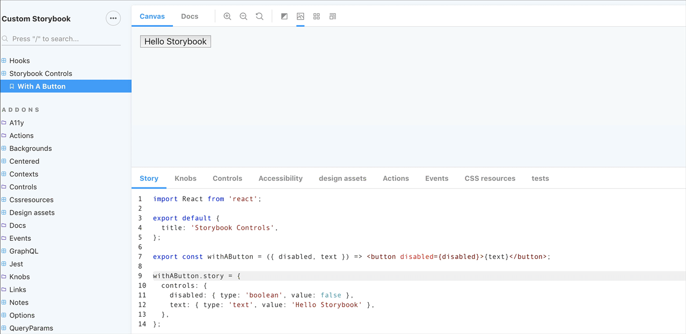
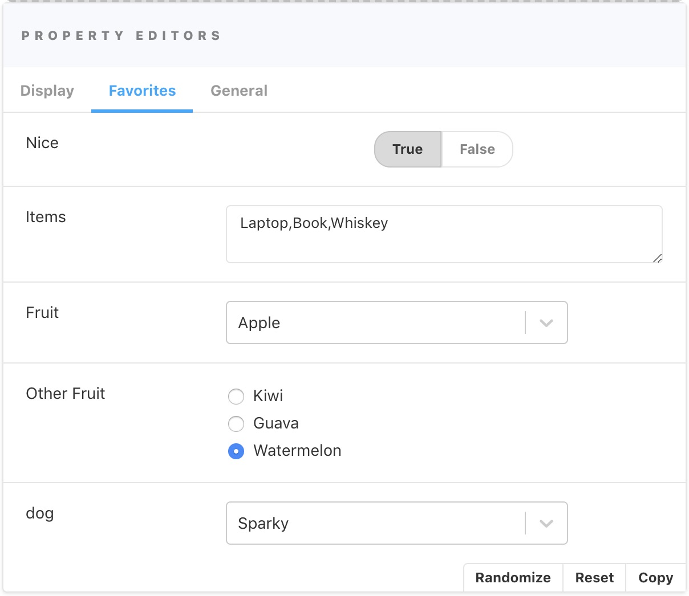
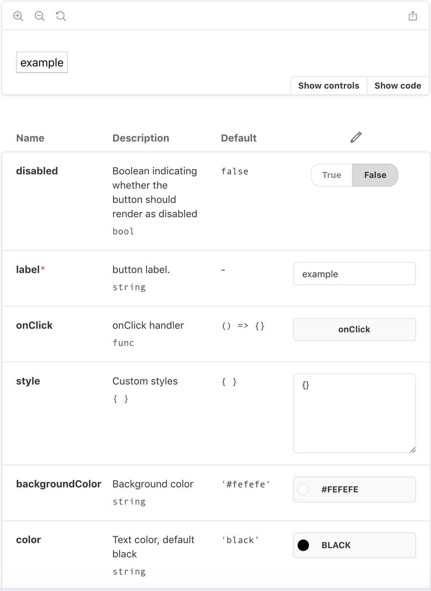
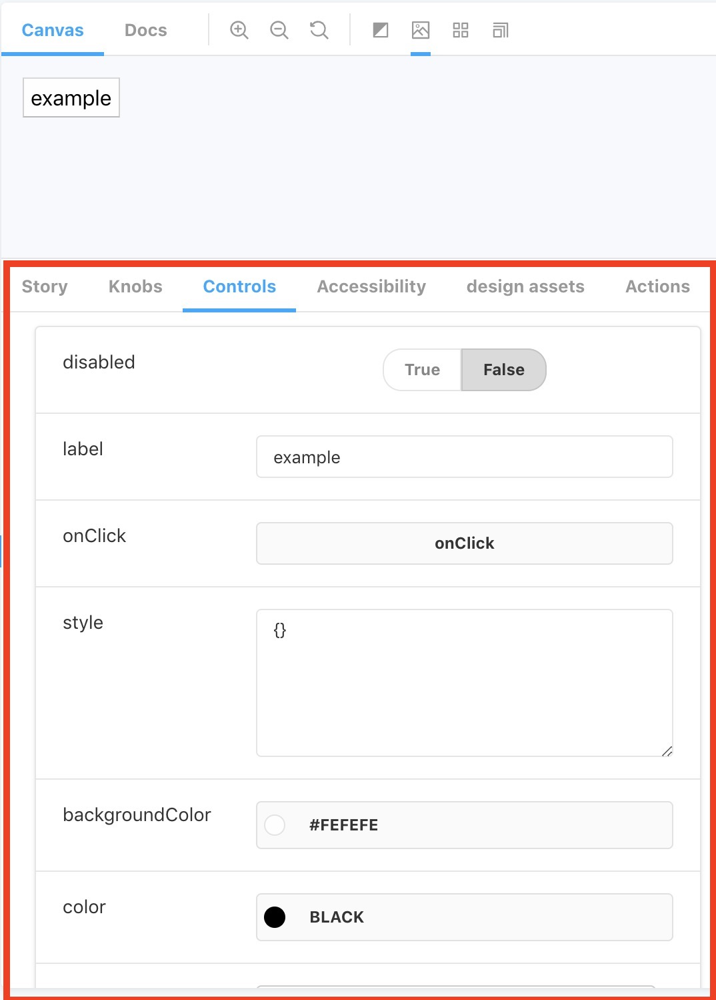
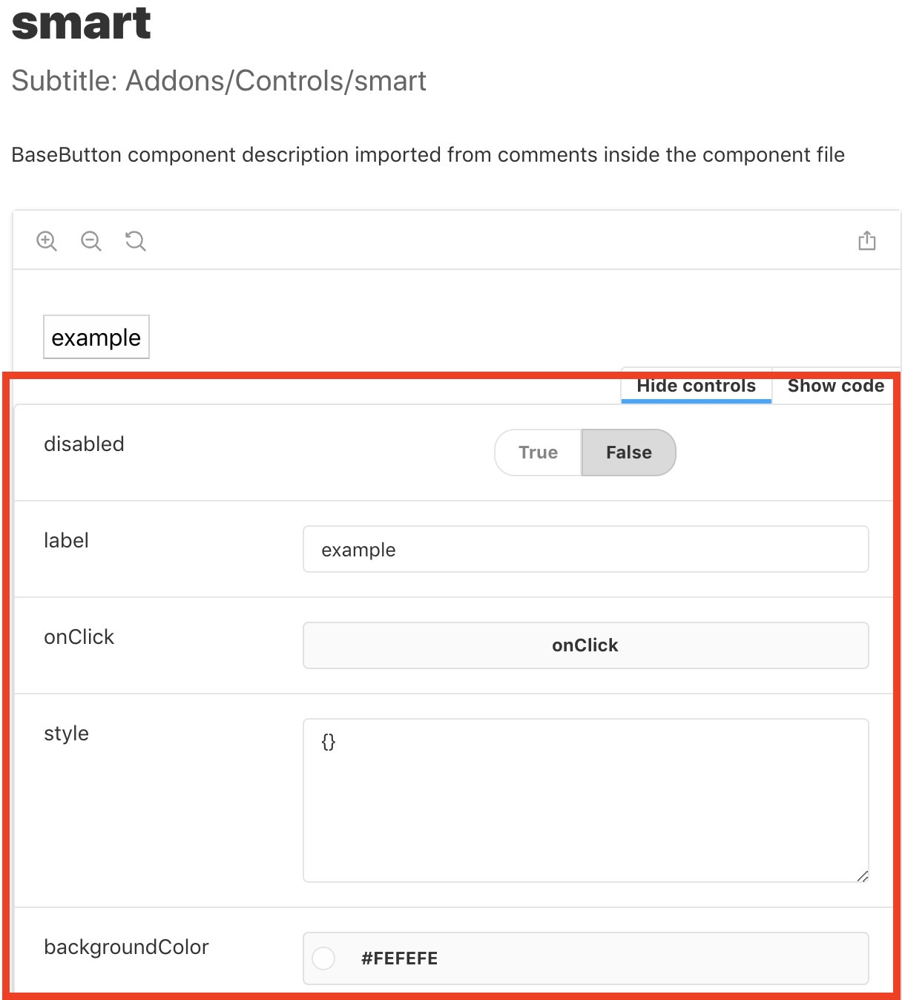
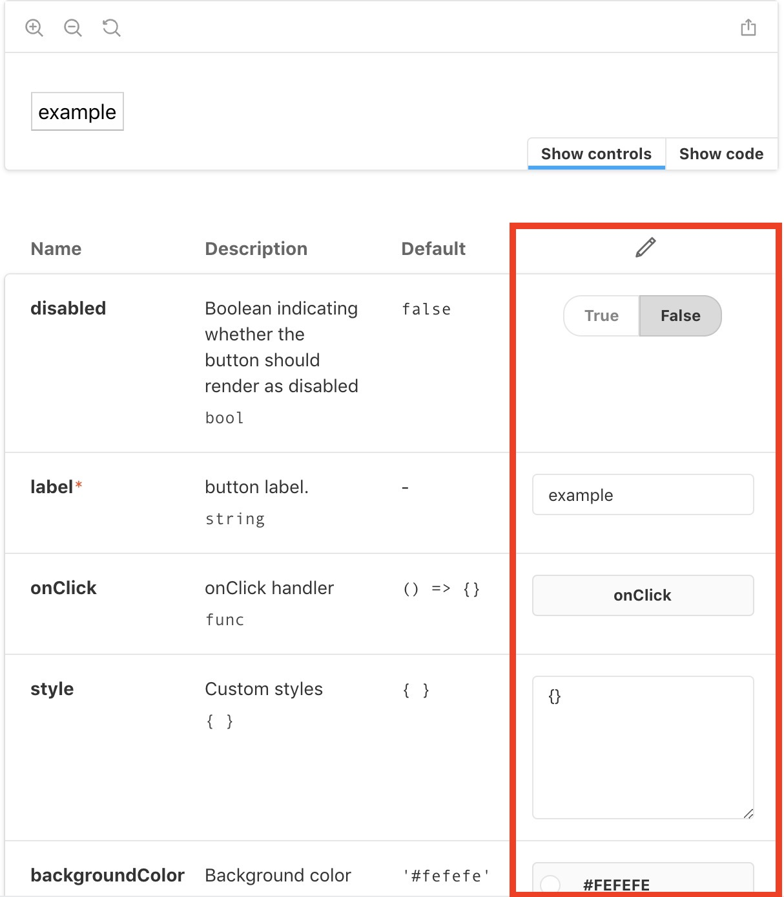

# Storybook Addon Controls

Storybook Addon Controls allows you to define and then edit story properties dynamically in the Storybook UI with a set of property editors. 
The values from the controls are passed down as parameters to the stories in [Storybook](https://storybook.js.org). 

The definitions of the control properties have been contributed to the [CSF](https://github.com/storybookjs/csf) so they can be used by the entire industry and contribute to an already thriving eco-system. 

Additional functionality out of the box with Addon Controls are the "smart controls" - using the story's component property table to automatically create editable controls for the stories.

Another unique facet of Addon Controls is the one-click generation of random data, using under the hood [faker.js](https://github.com/marak/Faker.js/).

Addon Controls is a successor of [addon-knobs](https://github.com/storybookjs/storybook/tree/next/addons/knobs) and tries to keep compatibility where possible.

Addon controls and the  bundled "smart-controls" can work with all frameworks supported by Storybook 

[Framework Support](https://github.com/storybookjs/storybook/blob/master/ADDONS_SUPPORT.md).

## Intro writing custom controls with react:



## Intro using smart-controls with react


## Getting Started

First of all, you need to install Addon Controls into your project as a dev dependency.

```sh
yarn add @component-controls/storybook-addon-controls --dev
```

within `.storybook/main.js`:

```js
module.exports = {
  addons: ['@component-controls/storybook-addon-controls']
}
```

That's it, you can now use controls inside your stories

### With React
```js
import React from "react";

export default {
  title: "Storybook Controls",
};

export const controlsStory = ({ disabled, text }) => (
  <button disabled={disabled}>
    {text}
  </button>
);

controlsStory.story = {
  controls: {
    disabled: { type: 'boolean', value: false },
    text: { type: 'text', value: 'Hello Storybook' },
  }
}
```

### With MDX
```md
import { Story, Preview, Meta } from '@storybook/addon-docs/blocks';
import { ControlsEditorsTable } from '@component-controls/storybook-addon-controls/blocks';

<Meta title="Storybook controls" />

<Preview>
  <Story name="controlsStory" 
    controls={{
      disabled: { type: 'boolean', value: false },
      text: { type: 'text', value: 'Hello Storybook' },
    }}
  >
    {({ disabled, text }) => (
     <button disabled={disabled}>
      {text}
      </button>
    )}  
  </Story>
</Preview>
```

### With Vue.js
```js

import MyButton from './MyButton.vue';

export default {
  title: "Storybook Controls",
};

export const controlsStory = ({ disabled, text }) => ({
  components: { MyButton },
  props: {
    isDisabled: {
      default: disabled
    },
    text: {
      default: text
    }
  },
  template: `<MyButton :isDisabled="isDisabled">{{ text }}</MyButton>`
});

controlsStory.story = {
  controls: {
    disabled: { type: 'boolean', value: false },
    text: { type: 'text', value: 'Hello Storybook' },
  }
}
```

MyButton.vue:
```vue
<template>
  <button :disabled="isDisabled">
    <slot></slot>
  </button>
</template>

<script>
export default {
  props: {
    isDisabled: {
      type: Boolean,
      default: false
    }
  }
}
</script>
```

### With Angular
```js

import { Button } from '@storybook/angular/demo';

export default {
  title: "Storybook Controls",
};

export const controlsStory = props => ({
  component: Button,
  props,
});

controlsStory.story = {
  controls: {
    disabled: { type: 'boolean', value: false },
    text: { type: 'text', value: 'Hello Storybook' },
  }
}
```

### With Ember
```js
import hbs from 'htmlbars-inline-precompile';

export default {
  title: 'StoryBook Controls',
};

export const controlsStory = context => ({
  template: hbs`
    <button disabled={{disabled}}>{{text}}</button>
  `,
  context,
});

controlsStory.story = {
  controls: {
    disabled: { type: 'boolean', value: false },
    text: { type: 'text', value: 'Hello Storybook' },
  }
}
```

## Categorization

This is very similar to the categorization concept in [addon-knobs](https://github.com/storybookjs/storybook/tree/next/addons/knobs).
Categorize your controls by assigning them a `groupId`. When a `groupId` exists, tabs will appear in the Controls storybook panel or in the docs blocks on the Docs page to filter between the groups. Controls without a `groupId` are automatically categorized into the `OTHER` group.

```js
export const groupedControls = ({ age, name, message }) => {
  const content = `
    I am ${name} and I'm ${age} years old.
    ${message}
  `;

  return <div>{content}</div>;
};

const personalGroupId = 'personal info';
const generalGroupId = 'general info';

groupedControls.story = {
  controls: {
    name: { type: 'text', label: 'Name', value: 'James', groupId: personalGroupId },
    age: { type: 'number', label: 'Age', value: 35, groupId: personalGroupId },
    message: { type: 'text', label: 'Mesage', value: 'Hello!', groupId: generalGroupId },
  },
};
```

You can see Controls in separate tabs as shown below.



## Available Controls

The list of available controls and their documented properties is available on the [Component Story Format](https://github.com/storybookjs/csf) site.


## Smart Controls

Smart Controls use a story component's properties table type information to generate automatically controls for the story. 

By default, Addon Controls enables the smart-controls option for your storybook  site, but there are 2 basic requirements for a story to use smart controls: 
1. The story needs to have a component assigned, and this component needs to have a valid properties table (it can be typescript, or prop-types or any other format supported by Storybook).
2. The story needs to accept "some" parameters / internally detected by Addon Controls within the source loaders / enabling the story to use the passed control values.

```js
import React from 'react';
import Button from '../../components/BaseButton';

export default {
  title: 'Storybook smart controls',
  parameters: {
    component: Button,
  },
};

export const smartControls = props => <Button {...props} />;
```

A screenshot of smart controls in action.




### Smart controls options
- **include** an array of property names that allows you to select only a subset of the smart control properties to be displayed

```js
onlyColors.story = {
  parameters: {
    controls: {
      smart: {
        include: ['color', 'backgroundColor'],
      },
    },
  },
};
```

- **exclude** an array of property names that allows you to exclude a subset of the smart control properties to be displayed

```js
noColors.story = {
  parameters: {
    controls: {
      smart: {
        exclude: ['color', 'backgroundColor'],
      },
    },
  },
};
```

## Testing with random data generators

This is one of our favorite features, basically allowing 1-line functional component testing out of the box.

By default, Addon Controls selects some basic random data generator for your field type.

Additionally, Addon Controls allows you to specify the [faker.js](https://github.com/marak/Faker.js/) data generator and options to use. For example you can be specific that a field will need to be a street address, or a zip code. In the example below, we will generate random numbers between 50 and 100.

```js
export const randomNumber = ({ number }) => number;

randomNumber.story = {
  controls: {
    number: {
      type: 'number',
      label: 'A number',
      value: 10,
      data: { name: 'random.number', options: { min: 50, max: 100 } },
    },
  },
};
```

## Doc blocks

By default, Addon Controls integrates in the addon panels, in the `<Props />` table on the StoryBook DocsPage and well as in the `<Preview />` component on the DocsPage. You can also add a specifc docs block with story controls by either changing the default DocsPage or directly in your `mdx` stories:

```js
import { Title, Subtitle, Description, Story, Props, Stories } from '@storybook/addon-docs/blocks';
import { ControlsEditorsTable } from '@component-controls/storybook-addon-controls/blocks';


export default {
  title: 'Addons/Controls/controls',
  parameters: {
    docs: {
      page: () => (
        <>
          <Title />
          <Subtitle />
          <Description />
          <Story id="." />
          <ControlsEditorsTable id="." />
          <Props />
          <Stories />
        </>
      ),
    },
  },
```

```md
import { Story, Meta } from '@storybook/addon-docs/blocks';
import { ControlsEditorsTable } from '@component-controls/storybook-addon-controls/blocks';

<Meta title="Storybook controls" parameters={{component: Button}} />


<Story name="small story">
  {props => (
    <Button {...props} />
  )}  
</Story>

<ControlsEditorsTable name="small story" />

```
## Options

Addon Controls accepts several option parameters to customize the default functionality. By default, all the following options are enabled, so you only need a custom configuration if you need to disable a feature:

within `.storybook/main.js`:

```js
  addons: [
    ...
    {
      name: '@component-controls/storybook-addon-controls',
      options: {
        addonPanel: false,
        docsPreview: false,
        docsProps: false,
        smart: false,        
      },
    },
  ],
```

### smart

Setting this option to `false` will disable auto-generating of controls for stories with a component assigned.


### addonPanel

Setting this option to `false` will disable showing the Controls panel in the addons section within the Storybook Canvas page:




### docsPreview

Setting this option to `false` will disable showing an additional tab and panel with Controls in the `<Preview />` component within the Storybopok DocsPage:



### docsProps

Setting this option to `false` will disable showing an additional columns with Controls in the `<Props />` component within the Storybopok DocsPage:




